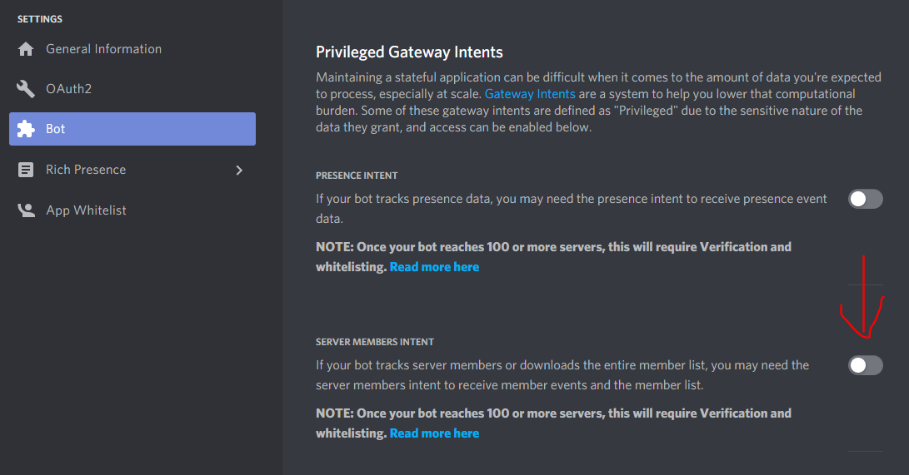
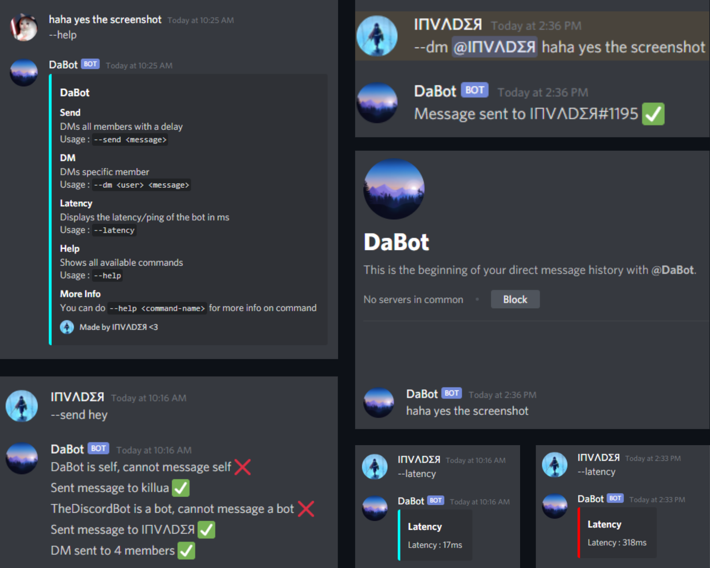

# Discord DM Bot 

- discord.py 1.7.2
- python 3.9.5
- asyncio 3.4.3

### Installation

#### Cloud Host
- Tutorial uploaded in YouTube, watch it by clicking [here][youtube_tutorial].

#### Local Host - Windows
- Install [Python 3.9][python_link]
- During the setup check `Install launcher for all users (recommended)` and `Add Python 3.9 to PATH` when prompted.
- Download Repository Zip & Extract it.
- Now Install dependencies - Run `install.bat`
- Go to `Discord Developers Page > Bot > Add Bot` and then toggle `Server Members Intent` (refer below image), then get bot token
- Add bot credentials to `config.json`
- Then run `bot.py`

Enabling Server Members Intent

### Description

A Bot which messages everyone in a Discord Server, if the member has DM's off or they have blocked the bot, they cannot be messaged

***

#### Commands
- `send <message>` Sends the message to all the members' DMs.
- `dm <member> <message>` Sends the messsage to the mentioned member's DMs.
- `help <optional-command-name>` Displays the available commands, you can provide a command name to get more info on the command
- `latency` Displays the latency / ping

#### Note: The bot cannot DM **_bots_**, **_the members who either have their DMs turned off_** or **_the members who have blocked the bot_**.

#### Features
- You can turn off the bot logging after each DM in the command `send`, by setting the **_`log_dms`_** to **_`off`_** or **_`disabled`_** in **_`config.json`_**
- You can adjust or even remove the ***delay*** (**_delay_** in between the multiple DMs) according to your will in ***`config.json`***(in seconds).

#### Note : The ***more is the delay***, ***the less is the chance of your bot getting rate limited*** **(5msgs - 5s is the rate limit for messages)**.

### Support

Having issues with the bot lately? Join the [Discord Server][discord] where we can help figure out your issue. If you have a major bug to report, it would be great if you can an [issue here](https://github.com/invader1234/discord-dm-1.7.2/issues).

### Screenshots

### Contact me:
[][website]
[][youtube]
[][discord]

 

### Latest YouTube Videos

- [\[DISCORD\] Login To A Bot's Account](https://www.youtube.com/watch?v=Z-S5SvgbmrM)
- [Fun & Anti Raid Bot | DBM Series E2](https://youtu.be/Cqaxt5GTfuo)
- [Welcome + Leave Message Bot | DBM SERIES E1](https://youtu.be/gS8Ncj0A-jA)
- [more videos...](https://youtube.com/invader6)

### Disclaimer
> This is tool was made for educational purposes and proof of concepts. I'm not accountable for any unlawful, unprecedented action and any violation of ToS administered by a third party.

Made with Python!

[website]: https://sites.google.com/view/invaderop/home
[discord]: https://discord.gg/XxBv46EtHM
[youtube]: https://www.youtube.com/channel/UCDUN4_DWVoYx-ZupD9rhlmw
[youtube_tutorial]: https://youtu.be/Sogd23Uibd0
[python_link]: https://www.python.org/downloads/release/python-395/
